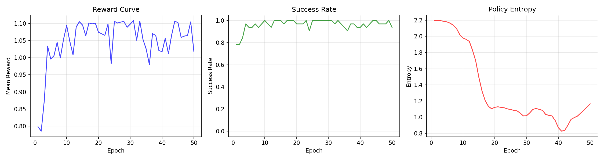

# Milestone 3: Training

## What GRPO Is

**Group Relative Policy Optimization** (from DeepSeekMath, 2024) is a simplified alternative to PPO for RL fine-tuning. The key difference: PPO learns a value function to estimate baselines, while GRPO uses the group itself as the baseline.

For each task, GRPO generates G episodes ("a group") with the current policy. Within each group, episode returns are normalized to zero mean and unit variance — high-return episodes get positive advantage, low-return ones get negative. The policy is updated with clipped gradients (like PPO) to increase probability of actions from good episodes and decrease probability from bad ones. A KL penalty against a frozen reference policy prevents catastrophic forgetting.

**Why GRPO for this problem:** The environment has discrete actions (9 annotation indices) and sparse-ish rewards (+1 for goal, -0.01 per step, +0.1 per BFS edge closer). With only 4 tasks and ~170 states, a critic network would be overkill. GRPO's group normalization provides a stable baseline without one.

## Training Setup

- **Policy**: Small CNN (3 conv layers → 256-dim FC → 9 actions), 84x84 input
- **Algorithm**: GRPO with clip=0.2, KL beta=0.01, entropy bonus=0.05
- **Group size**: 8 episodes per task per epoch (32 total per epoch)
- **Epochs**: 50 (converges by ~10)
- **Learning rate**: 3e-4 with Adam
- **Training time**: 10 seconds (state graph env = microseconds per step)

## Results

### Reward Curve

The reward climbs from +0.80 to +1.10 in the first 10 epochs, then stabilizes. Success rate reaches 97-100%. Entropy drops from 2.2 to ~1.0 — the policy becomes selective but doesn't fully collapse (entropy bonus prevents this).

### Eval Comparison: Before vs After Training

| Task | Random Baseline | Trained GRPO |
|------|:-:|:-:|
| search→results | FAIL (0/8 steps) | **PASS (2/8 steps)** |
| results→cart | FAIL (0/12 steps) | **PASS (11/12 steps)** |
| cart→traveler | FAIL (0/8 steps) | **PASS (5/8 steps)** |
| traveler→seats | FAIL (0/20 steps) | FAIL (0/20 steps) |
| **Success rate** | **0%** | **75%** |

Both evaluated against the **live browser** using the eval harness (not the training env).

### Training Env Performance

| Task | Random Policy | Trained GRPO |
|------|:-:|:-:|
| search→results | 91% | 100% |
| results→cart | 78% | 100% |
| cart→traveler | 71% | 100% |
| traveler→seats | 93% | 100% |
| **Overall** | **83%** | **~98%** |

## Why It Works (and Why It Doesn't)

**Why 3/4 tasks succeed on live eval:** The eval bridge queries `window.__annotations__()` at each step to get the current interactive elements and their bboxes. The policy picks an annotation index; the bridge converts that to a pixel-coordinate click at the bbox center. For tasks where all buttons are in the viewport, this works well.

**Why traveler→seats fails:** The "Next: Seats & Extras" button sits at y=1499 in the live browser — 600px below the 900px viewport. The training env doesn't model scrolling (it operates on the state graph, where all annotations are accessible regardless of viewport position). So the policy never learned to scroll. When the bridge clicks at y=1527, it misses the button entirely.

**Why training was so fast:** The state graph environment runs at millions of steps/second — every `step()` is a dict lookup. 50 epochs × 32 episodes × ~6 steps = ~10,000 environment interactions, all completing in seconds. The papers use 7B VLMs with GPU-hours of training because they operate on actual screenshots with full visual reasoning. Our CNN sees 84x84 synthetic-colored rectangles and learns a lookup table, not visual understanding.

## What Would Help With More Time

1. **Scroll actions in the action space** — Add scroll-up/scroll-down as discrete actions. The training env would need a viewport model to simulate which annotations are visible at each scroll position.

2. **Dense checkpoint rewards** (InfiniteWeb's insight) — The traveler form has ~10 fields. Currently the agent gets no reward until it reaches the seats step. Awarding +0.05 for each filled field would provide gradient signal for the hardest task.

3. **CoT annotations** (OpenCUA's insight) — The policy learns which button to click from pixel patterns, but it doesn't reason about *why*. Annotating each state with "I see the search form, I need to click 'Search flights'" would enable SFT on reasoning traces before RL.

4. **Larger model on real screenshots** — A vision-language model (even a small 3B) would generalize from real screenshots instead of memorizing synthetic colored rectangles. The current CNN is essentially a state-ID classifier, not a visual agent.

5. **Entropy regularization tuning** — The entropy drops from 2.2 to ~1.0 over training. This is healthy for our 9-action space, but with a larger action space or harder tasks, the policy would likely collapse to a single action without sufficient entropy bonus.
